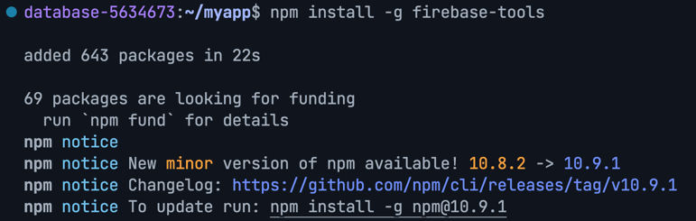
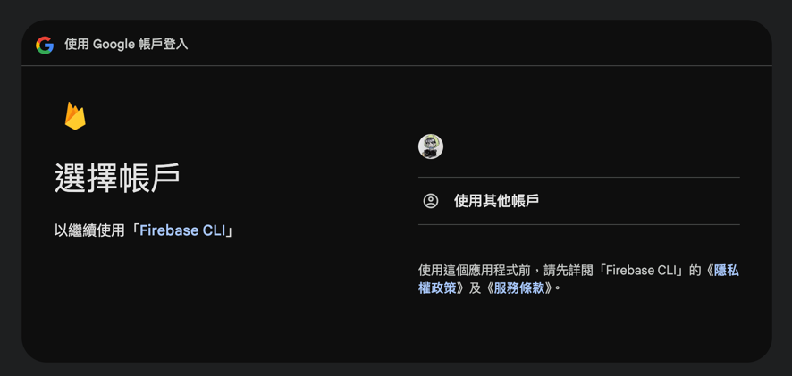
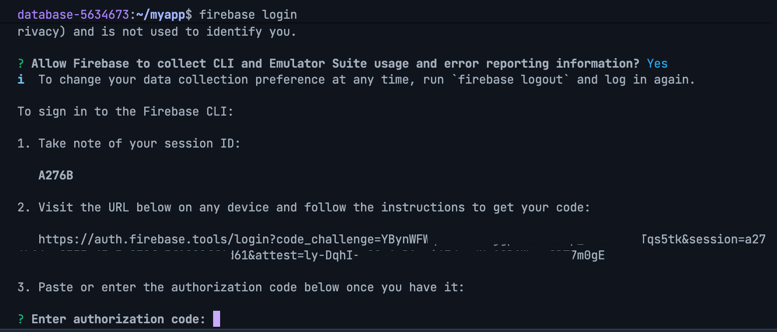
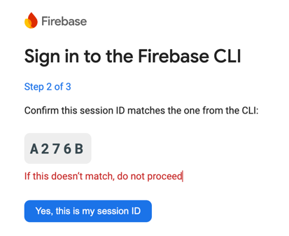
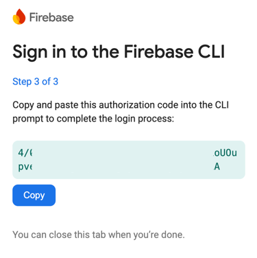

# firebase_database

Demo of firebase

## I. 整合

先確認環境是否有安裝 node.js，再往下執行

### 1. 安裝環境工具

#### 1.1 Firebase tools

- 安裝指令
   ```shell
   npm install -g firebase-tools
   ``` 
- 如果版本不符，會看到類似如下截圖

  

#### 1.2 FlutterFire CLI

- 安裝指令
  ```shell
  dart pub global activate flutterfire_cli
  ```

### 2. 使用

#### 2.1 登入 Firebase

- 指令
   ```shell
   firebase login
   ```

- 登入可能有兩種狀況
    - 登入方式一：可以在本地端直接以瀏覽器同步登入
        - 開啟瀏覽器

          

        - 登入「成功」

          

    - 登入方式二：透過連結的非同步跨環境登入
        - Terminal 給的連結

          

        - 登入 Google 帳號，確認是同樣的 session ID

          

        - 複製代碼貼回 Terminal

          

#### 2.2 設定 Flutter 專案

1. 設定 對應的 Firebase 專案

    - 指令
       ```shell
       flutterfire configure
       ```
    - 可以先觀察一下專案中加入哪些檔案

2. 在 Flutter 專案中加入 `firebase_core`
    - 指令
       ```shell
       flutter pub add firebase_core
       ```

3. 回到 `main.dart` 加 import

   ```dart
   import 'package:firebase_core/firebase_core.dart';
   import 'package:firebase_database/firebase_options.dart';
   ```

### 3 使用 Firebase 的功能

#### 3.1 使用 Hosting

1. 指令
    ```shell
    firebase experiments:enable webframeworks
    firebase init hosting
    ```
    - 指令執行下去後，會依序看到下方幾個操作步驟
        - 選擇要使用 hosting 的專案
        - 會問是否使用 Flutter Web codebase，預設：Yes
        - 選擇 server 的地區
        - 是否使用自動部署，預設：No
        - 可以觀察一下專案中增加的東西

2. 部署

    ```shell
    firebase deploy
    ```

#### 2.3 使用 RemoteConfig

1. 先到 Firebase Project 中增加一個 `version` 的字串設定值
2. 在 Flutter 專案中加入 `firebase_remote_config`
    - 指令
    ```shell
    flutter pub add firebase_remote_config
    ```
3. 到 `main.dart` 加入以下程式
    - 增加一個全域變數 `remoteConfig`
      ```dart
      // 在 main function 上面加入全域變數
      late FirebaseRemoteConfig remoteConfig;

      Future<void> main() async { 
          //...
      }
      ``` 
    - 加入 remote config 的初式化函式
      ```dart
      Future<void> main() async { 
          //...
      }
      // 加在 main function 下方
      _initialRemoteConfig() async {  
        await remoteConfig.setConfigSettings(RemoteConfigSettings(
          fetchTimeout: const Duration(minutes: 1),
          minimumFetchInterval: const Duration(hours: 1),
        ));
        await remoteConfig.setDefaults(const {
          "version": "0.1.0",
        });
        await remoteConfig.fetchAndActivate();
      }
      ```
    - 於 main() 中初始化
      ```dart
      Future<void> main() async {
          //... 
          remoteConfig = FirebaseRemoteConfig.instance;
          await _initialRemoteConfig();
          
          runApp(const MyApp());
      }
      
      _initialRemoteConfig() async {  
        //...
      }
      ```
4. 到 `home_page.dart` 中加入以下程式
    - 在 _HomePageState 中，加入變數呼叫
      ```dart
      WidgetsBinding.instance.addPostFrameCallback((_) {
        setState(() {
          _version = remoteConfig.getString("version");
        });
      });
      ``` 
      
