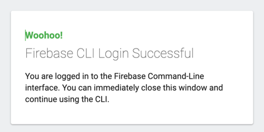

# firebase_database

Demo of firebase

## I. 整合

先確認環境是否有安裝 node.js，再往下執行

### 1. 安裝環境工具

#### 1.1 Firebase tools

- 安裝指令
   ```shell
   npm install -g firebase-tools
   ``` 
- 如果版本不符，會看到類似如下截圖

  

#### 1.2 FlutterFire CLI

- 安裝指令
  ```shell
  dart pub global activate flutterfire_cli
  ```

### 2. 使用

#### 2.1 登入 Firebase

- 指令
   ```shell
   firebase login
   ```

- 登入可能有兩種狀況
    - 登入方式一：可以在本地端直接以瀏覽器同步登入
        - 開啟瀏覽器

          

        - 登入「成功」

          

    - 登入方式二：透過連結的非同步跨環境登入
        - Terminal 給的連結

          

        - 登入 Google 帳號，確認是同樣的 session ID

          

        - 複製代碼貼回 Terminal

          

#### 2.2 設定 Flutter 專案

1. 設定 對應的 Firebase 專案

    - 指令
       ```shell
       flutterfire configure
       ```
    - 可以先觀察一下專案中加入哪些檔案

2. 在 Flutter 專案中加入 `firebase_core`
    - 指令
       ```shell
       flutter pub add firebase_core
       ```

3. 回到 `main.dart` 加 import

   ```dart
   import 'package:firebase_core/firebase_core.dart';
   import 'package:firebase_database/firebase_options.dart';
   ```

### 3 使用 Firebase 的功能

#### 3.1 使用 Hosting

1. 指令
    ```shell
    firebase experiments:enable webframeworks
    firebase init hosting
    ```
    - 指令執行下去後，會依序看到下方幾個操作步驟
        - 選擇要使用 hosting 的專案
        - 會問是否使用 Flutter Web codebase，預設：Yes
        - 選擇 server 的地區
        - 是否使用自動部署，預設：No
        - 可以觀察一下專案中增加的東西

2. 部署

    ```shell
    firebase deploy
    ```

#### 3.2 使用 RemoteConfig

##### 3.2.1 Firebase 的設定

1. 先到 Firebase Project 中增加一個 `version` 的字串設定值

##### 3.2.2 Flutter 的程式碼變動

###### A. 專案環境更新

1. 在 Flutter 專案中加入 `firebase_remote_config`
    - 指令
    ```shell
    flutter pub add firebase_remote_config
    ```

###### B. `main.dart`

1. 增加一個全域變數 `remoteConfig`
    ```dart
    // 在 main function 上面加入全域變數
    late FirebaseRemoteConfig remoteConfig;

    Future<void> main() async { 
        //...
    }
    ``` 

2. 加入 remote config 的初式化函式
    ```dart
    Future<void> main() async {
      //...
    }

    // 加在 main function 下方
    _initialRemoteConfig() async {  
      await remoteConfig.setConfigSettings(RemoteConfigSettings(
        fetchTimeout: const Duration(minutes: 1),
        minimumFetchInterval: const Duration(hours: 1),
      ));
      await remoteConfig.setDefaults(const {
        "version": "0.1.0",
      });
      await remoteConfig.fetchAndActivate();
    }
    ```

3. 於 main() 中初始化
    ```dart
    Future<void> main() async {
    //...
    remoteConfig = FirebaseRemoteConfig.instance;
      await _initialRemoteConfig();
            runApp(const MyApp());
    }
        
    _initialRemoteConfig() async {  
          //...
    }
    ```

###### C. `home_page.dart`

1. 在 _HomePageState 中，加入變數呼叫
    ```dart
    WidgetsBinding.instance.addPostFrameCallback((_) {
      setState(() {
        _version = remoteConfig.getString("version");
      });
    });
    ``` 

#### 3.3 使用 Realtime Database

#### 3.3.1 Firebase 的設定

1. 先到 Firebase Project 中增加一個 `counter` 的數值
2. 先確認規則(rule)，測試開發階段先開啟，日後要記得調回來

      ```json
      {
      /* Visit https://firebase.google.com/docs/database/security to learn more about security rules. */
        "rules": {
          ".read": true,
          ".write": true
        }
      }
      ```

#### 3.3.2 Flutter 的程式碼變動

###### A. 專案環境更新

1. 設定完畢後，回到 Flutter 專案來執行 firebase_opetions 更新
    - 指令
    ```shell
    flutterfire configure
    ```
2. 為專案加入 `firebase_database`
    - 指令
       ```shell
       flutter pub add firebase_database
       ```

###### B. 程式碼變動：`home_page.dart`

1. 取出資料
    - 加入 `_getCounterFromRealtimeDatabase`
      ```dart
      _getCounterFromRealtimeDatabase() async {
        DatabaseReference ref = FirebaseDatabase.instance.ref();
        final snapshot = await ref.child("counter").get();
        if (snapshot.exists) {
          setState(() {
            _counter = snapshot.value as int;
          });
        }
      }
      ``` 
    - 於 initState() 中加入呼叫
      ```dart
      WidgetsBinding.instance.addPostFrameCallback((_) {
        setState(() {
          _version = remoteConfig.getString("version");
        });
        // 加入呼叫
        _getCounterFromRealtimeDatabase();
      });
      ``` 
2. 更新資料
    - 在 _increaseCounter() 中加入下方程式碼
       ```dart
       WidgetsBinding.instance.addPostFrameCallback((_) {
         setState(() {
           _version = remoteConfig.getString("version");
         });
         // 加入更新
         DatabaseReference ref = FirebaseDatabase.instance.ref();
         ref.update({"counter": _counter});
       });
       ``` 

#### 3.4 使用 Firestore

#### 3.4.1 Firebase 的設定

1. 建立資料庫
    - 「位置」選擇離服務當地最近者。
    - 要注意設定後無法變更。
2. 注意一下「規則」
3. 新增資料集合
    - 集合 ID：`news`
    - 文件 ID：用序號
        - 欄位：`title`
        - 欄位：`content`
    - 資料就麻煩各位自行隨便找一下新聞的標題跟內容嘍

#### 3.4.2 Flutter 的程式碼變動

###### A. 專案環境更新

- 為專案加入 `cloud_firestore`
    - 指令
       ```shell
       flutter pub add cloud_firestore
       ```

###### B. 程式碼變動：`news_page.dart`

1. 宣告並初始化 FirebaseFirestore
    ```dart
    final FirebaseFirestore _db = FirebaseFirestore.instance;
    ```
2. 取得資料，修改 _initialNewsList
    - 將原本迴圈的程式碼改成
    ```dart
    final collectionRef = _db.collection("news");
    collectionRef.get().then((querySnapshot) {
      for (QueryDocumentSnapshot docSnapshot in querySnapshot.docs) {
        Map<String, dynamic> snapshot = docSnapshot.data() as Map<String, dynamic>;
        final News news = News(title: snapshot["title"] ?? "", context: snapshot["content"]);
        setState(() {
          _list.add(news);
        });
      }
    });
    ```
3. 新增資料，修改 _createPost
    ```dart
    _createPost() {
      // 新增一筆資料
      if (_titleController.text.isEmpty && _contentController.text.isEmpty) {
        return;
      }
      final News news = News(title: _titleController.text, context: _contentController.text);
      final collectionRef = _db.collection("news");
      int id = _list.length + 1;
      collectionRef.doc(id.toString()).set({"title": news.title, "content": news.context}).then((value) {
        setState(() {
          _list.insert(0, news);
        });
      }).catchError((error) {
        print(error.toString());
      });
    }
    ```
4. 排序
    - Firestore 的階層為 collection > document > 文件中的欄位
    - 因此需指定
        - .orderBy("欄位名稱")
        - 如果要反序：.orderBy("欄位名稱", descending: true)
    - 部份程式碼的完整範例如下
        ```dart
        final collectionRef = _db.collection("news");
        collectionRef.orderBy("title", descending: true).get().then((querySnapshot) {
        for (QueryDocumentSnapshot docSnapshot in querySnapshot.docs) {
            Map<String, dynamic> snapshot = docSnapshot.data() as Map<String, dynamic>;
            final News news = News(title: snapshot["title"] ?? "", context: snapshot["content"]);
            setState(() {
            _list.add(news);
          });
          }
        });
        ``` 